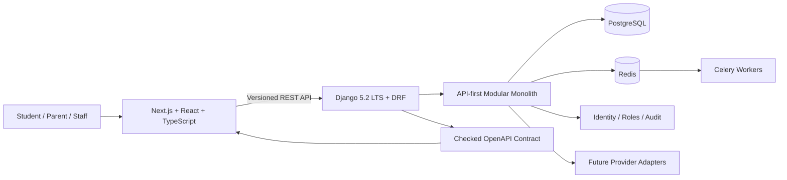

# TechBuilt Open School — Public Engineering Showcase

### Multilingual Education Platform & Operational LMS

**Django REST Framework · Next.js · PostgreSQL · Redis · Celery · OpenAPI · TypeScript · RTL**

Public-safe engineering overview for TechBuilt Open School (TBOS), a long-term education platform being developed in controlled phases.

---

## Repository Purpose

This public repository is a **showcase/reference repository**, not the canonical current source code.

The current TechBuilt Open School platform is developed in a separate private canonical repository because it contains active product discovery, operational decisions, safeguarding requirements, and implementation work that should not all be published during development.

The `frontend/` directory in this public repository is an earlier React/Vite public-site prototype and should not be confused with the current canonical Next.js/Django platform.

---

## Current Platform Direction

TechBuilt Open School is being built as a connected education platform for:

- public course/specialization discovery
- announced live group cohorts
- one-to-one tutoring
- custom learning plans
- demo classes
- admissions and enrolment operations
- payment-plan / verification workflows
- student, instructor and administration experiences
- schedules and live-class references
- attendance
- assignments, quizzes and submissions
- learning progress
- guardian/consent boundaries
- support and safeguarding operations
- audit-oriented administration

Later recorded-course and free-learning phases are intentionally separate from the current Phase 1 scope.

---

## Architecture

### Engineering approach

- API-first modular monolith
- separate web/API deployables
- PostgreSQL transactional source of truth
- Redis separation for cache / worker infrastructure
- checked OpenAPI contract
- explicit environment profiles
- multilingual publication boundaries
- least-privilege identity/authorization direction
- security and quality gates before production promotion

Microservices are deliberately deferred until measured scale/isolation requirements justify them.

---

## Current Delivery Status

| Area | Public-safe status |
|---|---|
| Product discovery / governance | Requirements baseline established; some founder/legal/operational decisions remain gated |
| Enterprise application foundation | Implemented in canonical main branch |
| Public multilingual experience | Active development in controlled branches |
| Identity principal | Active development |
| Roles / grants / audit | Active development |
| Business domains | Governed/planned in phases; not all claimed as implemented |
| Production launch | Not claimed |

This status distinction is intentional: **requirements, draft implementation, merged code, and production behavior are not treated as the same thing.**

---

## Foundation Stack

Current canonical engineering foundation includes:

### Backend

- Python 3.13
- Django 5.2 LTS
- Django REST Framework
- PostgreSQL
- Redis
- Celery
- structured JSON logging
- correlation/request IDs
- liveness/readiness endpoints
- versioned `/api/v1/` contracts
- checked OpenAPI

### Frontend

- Next.js 16
- React 19
- TypeScript
- Tailwind CSS
- shared UI package
- locale-aware routing
- strict CSP/nonce foundation
- publication-aware metadata

### Quality & Security

- Ruff
- strict mypy
- pytest / pytest-django
- coverage floor for the foundation
- ESLint / Prettier
- strict TypeScript
- Vitest
- production builds
- dependency audits
- Gitleaks
- SBOM generation
- Trivy container scanning
- reviewed/pinned CI tooling

---

## Multilingual & RTL Direction

The platform has code-level locale support for:

- English
- Urdu
- Hindi
- Pashto

Current publication policy is intentionally narrower:

- **English + Urdu** are the approved initial publication languages
- Hindi/Pashto remain extension points until content review/ownership is ready
- Urdu/Pashto layout foundations account for RTL behavior

---

## Identity & Safeguarding Principles

The current platform direction separates:

- stable user identity
- contact identifiers
- student/instructor/administration roles
- scoped administration grants
- guardian relationships / consent
- safeguarding states
- finance/payment access
- audit evidence

Instructor access is intentionally separated from learner/guardian contact and finance data.

The project is designed to handle minors and sensitive education operations with explicit boundaries rather than one generic “user role” flag.

---

## Public Prototype in This Repository

The code under `frontend/` demonstrates an earlier public-site prototype using:

- React 18
- TypeScript
- Vite
- Tailwind CSS
- React Router
- TanStack Query
- React Hook Form
- Zod
- Recharts
- Framer Motion
- Vitest / Testing Library

It includes public-page concepts such as courses, specializations, roadmaps, pricing, FAQs, testimonials, contact/apply flows, privacy and terms.

This prototype is preserved as public visual/frontend evidence; it is not the authoritative source for the current platform architecture.

---

## Why the Canonical Source Is Private

The active repository contains material that is not appropriate to publish indiscriminately during development, including:

- operational policies
- product decision registers
- safeguarding boundaries
- payment/refund operations
- staged identity/authorization work
- internal risk/dependency tracking

Keeping those materials private while publishing architectural evidence is an intentional engineering/product-governance choice.

---

## Founder / Engineering

**Shahriyar Khan**  
Co-Founder, TechBuilt Open School · Software Engineer · Full-Stack Python Developer

**Engineering focus:** Python · Django · DRF · Next.js · React · PostgreSQL · Redis · Celery · REST APIs · Application Architecture

- Portfolio: https://shahriyarkhan.com
- GitHub: https://github.com/Shahriyar-Kh
- LinkedIn: https://www.linkedin.com/in/shahriyar-khan-developer/

---

**Public evidence without exposing private product, learner, finance or operational data.**

